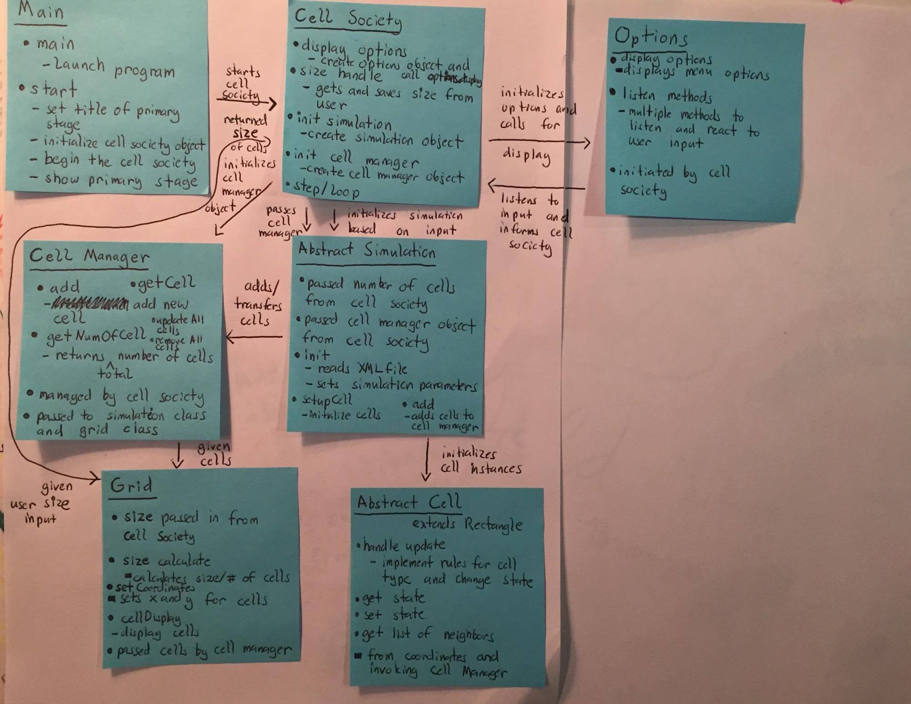
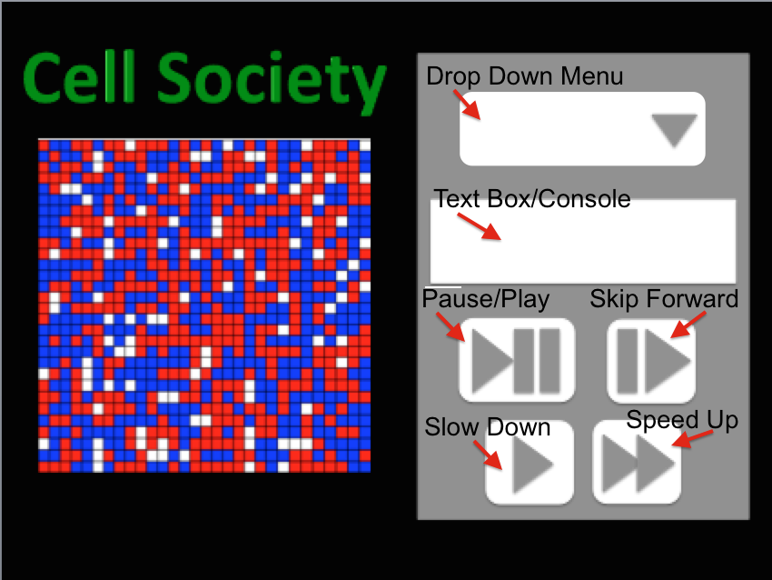
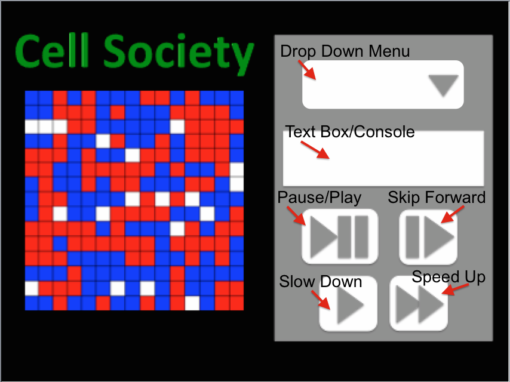

### cellsociety
Duke CompSci 308 Cell Society Project

Bruna Liborio (bml27), Rhondu Smithwick (rs44), Tavo Loaiza

### Introduction
* This project allows users to specify a simulation, which will then be carried out on a grid of Cell Automata.
* The primary area of flexibility will be in the design of the cells and simulation. Each simulation
	will work on the same grid, but with different types of cells that have different properties and with different simulation
  parameters. Adding simulation and cell classes and writing XML files for these classes will allow the program to be 
  open and extended. 
* The program will be closed in its interaction with the user and transition between different simulations. The code to listen
	and react correctly to user input will be closed as that process should be the same no matter the number of simulations 
	included or how the program is extended.
* Adding a new option for user control may add something that the program has to 
	monitor and listen to and may add a method that the program will execute when it gets the new input, but any pre-existing 
	methods will not need to be changed and the way the program transitions between simulations will still be closed regardless.
* In general...
	* One class will handle transitions between simulations and will be connected to all other classes to monitor 
		the flow of the program. 
	* Another class will be in charge of the cells and updating their states. 
  * A third major class is in charge of the grid, including monitoring cell locations and applying any new statuses to the 
    user interface. 
	* The options screen will be handeled by yet another class which will throw exceptions to the user and handle the options display. 
  * Separate classes will exist for the simulation types which will all be extensions from a template abstract class. 
  * Each simulation type will have different customized cells which will again exist for all simulation types and 
    which will again be extenstions of the same abstract class. 
  * Overall, there will be one class monitoring the program flow. Separate classes will handle each user interface screen 
    (See the User Interface seciton), and simulation and cell types will exist for each implemented simulation and will
    be extensions of the same abstract base classes. 

### Overview
* Main.java will run the the program by instantiating a CellSociety object and showing its stage
* CellSociety.java will hold a GUI and run simulations based on user input
	* Fields: cellManager, grid, GUI
  * Methods: init, getSimulation, beginSimulation
* The Simulation will be a base class that all Simulations (Fire, Segregation, ec...) will extend from
	* Each simulation subclass will parse its required XML file and sets its properties based on that
  * Each simulation subclass will have methods to change its properties 
  * Methods: init, updateCells
* The Cell class will be a base class for all other cells (Fire, Segregation, etc...) to extend from
	* Extended from Rectangle
  * Key inherited methods: setX(double x), setY(double y), setFill
  * Methods: handleUpdate(double elapsedTime), setImage(Image image)
* The CellManager will manage the cells so that they can be easily changed
	* Fields: Collection<Cell> theCells
  * private void createCells(String cellType, double gridWidth, double gridHdeight, int cellsPerRow, int cellPerColumn)
  * private static Cell createCell(String cellType, double width, double height, double x, double y) 
  	* switch statements based on cellType?
    * returns a Cell of subclass cellType
* The Grid class will recieve a list of cells from CellManager and allow them to be displayed 
*	The GUI class will display the options screen and monitor user input. It will redirect user signals to the appropriate 
	CellSociety class method. 

Below is a diagram of the program's classes with some of their basic methods and how they will interact with each other.
Note that the 'Options class' has been changed to be called the 'GUI class' in order to more clearly denote its functions.  

### User Interface
The user interface will be handled mainly by the GUI class and will consist of one larger rectangular screen of a fixed size that will contain two smaller screens
within it side by side. The screen on the left will be the grid for the simlation. 
> **This left screen will...**
> 
*  Display a grid made up of state-changing squares controled by simulation parameters and rules specificed within 
the update method of the grid squares (ie. cells) defined in the Cell class for the simulation type.
*  Be a fixed overall size, with the number and size of the squares/cells within the grid varying based on user input. 

The screen on the right will be the options menu for the user. 
> **This right screen will...**
> 
* Include a drop down menu from which users can select a simulation. 
* Include a text box/console where users can specify the size for the grid dictating the number of squares/cells seen on 
the left screen, but which will not change the overall size of the left screen. This text box/console will also be used to 
display error messages indicating bad inputs or empty data errors. 
* Contain a pause and resume button for users to be able to periodically stop the simulation.
* Contain a step forward button which will allow users to skip the simulation forward a set number of steps at one time, 
ie. a certain number of update steps will be called while the grid appearance is not updated. The grid appearance will 
then be updated after the final state to reflect the new state. 
* Include a fast-forward and a slow-down button which will increase the step rate or slow down the step rate respectively.

Below are example images of what the simulation sceen with the two sub-screens described above will look like. 

		A sample user interface screen showing a grid with many cells

		A sample user interface screen showing a grid with fewer cells

To first start the simulation program, a simulation must be choosen from the drop down menu. The initial size for the cells 
and grid will be initial parameters set in the XML file for each simulation and read into the program from these files.
Selecting a simulation from the drop down menu while another is running will shut down the current simulation and begin 
the newly selected one. The Cell Society class will be listening for inputs from the drop down menu and, when an input is 
detected, will invoke the end method of the old simulation class to end it and will create and start the newly requested 
simulation class when a new option is selected (If user selects the same simulation that is already running from the drop 
down menu again, the current instance of that simulation will end and an new entirely new simulation, though of the same 
type, will start). The text box/console in the right screen can be used by the user whenever a simulation is already 
running to input a new size that will dictate the number of cells in the grid. The overall grid size will not be affected, 
but the number of grid squares/cells and their sizes within that set grid will change. Writing a number in the text 
box/console that is displayed on the right screen will reset the already selected simulation  with a grid reflecting the 
newly entered size (The size will be the number of squares per row on the grid). The selected simulation will play from 
the beginning using initial simulation parameters but with the new size. Besides changing the grid size, the text 
box/console on the right screen will also be used to display error messages. 
>  **Error messages will be displayed for the following erraneous situations...**
>  
* Entering a negative number for the size.
* Entering a number below the minimum size threshold.
* Entering a number above the maximum size threshold.
* Entering a number before a simulation has been selected/is running. 

### Design Details
* public class Main
	* Used to run the program 
  * Hands a stage to a Cell Society instance
  * A basic class needed for most programs
* public class CellSociety
	* The "real" main class
  * Center of everything
  * Controls a GUI that the user will interact with 
  		* Passes this information to other classes such as Simulation subclasses and CellManager
  * Instantiates a CellManager and acts as the mediator between this object and the Simulation subclass
  * Displays the grid to the user by passing it to the GUI interface
  * Begins a Simulations loop
  * Designed as such so that each of the other classes have as little interaction as possible; instead, CellManager acts as a central hub, allowing for exstensibility of code and dryness
* public class CellManager
	* Manages the cells on the grid and updates their properites. 
  *	Handles and maintains a cell list of cells matching the simulation type which is running. 
  * Interacts with the simulation class to generate necessary cells with the correct update function for the current simulation.
  	Initialized by the Cell Society class, which keeps the cell manager object. Passes the cell list to the Grid class so that 
    the cells can be displayed.
  * CellManager will be coded to handle the Abstract Cell class. It's functions can be extended to act on new kinds of cells
  	simply by creating a new cell class, thus the CellManager class can be extended by creating new derivative of the abstraction 
    Cell class it is based on. 
  * CellManager will be designed such that it can work with any cell and simulation type, since both of these classes are 
  	abstract and will be extended for the specific simulations. CellManager is meant to separate the detailed naunces of handeling 
    cells from the rest of the program, as it will have to frequently loop through the cell list it manages to update cells and 
    remove cells when simulations switch. We wanted to keep these functions separate from the rest of the program and wanted to 
    code them to work for any cell type in a separate class. 
* abstract class Simulation  
	* Extended by all implemented simulations
	* Each Simulation subclass will have its own specific parameters that it will parse from its specific XML file.	
	* Manages XML file reading and loads initial simulation parameter. It uses these parameters to create simulation specific cells. 
  * Uses XML files to define and set simulation parameters. It is passed in the CellManager which it uses to add its cells to. 
  * This class is initialized by CellSociety and interacts with the CellManager class by passing in newly initialized cells and 
  	with the Abstract Cell class in order to create new cells matching its simulation type.  
  * Abstract Simulation will be extended by simulation subclasses which will be designed to handle rules and parameters of 
  	new simulations that are to be incorporated into the program.
  * An Abstract simulation class was designed like this so that it can easily be extended to add new simulations with 
  	distinct parameters and rules. All classes that interact with the simulation class will be designed to simply work with 
    simulation and not its specific subclasses thus making the rest of the program very adaptable to new simulations. 
* public class Grid (May not be needed if its functions are incorporated into CellManager)
	* Displays CellManager's cells to users and holds some data structure to keep track of each cell's x and y values. Creates
  	the grid seen by the user where the simulation is run on. 
  * Uses a list of cells passed in by the Cell Manager to know which cells to display.
  * Interacts with CellManager which passes it the structure keeping all the cells. Interacts with CellSociety which passes 
  	it a size input given by the user. Grid then returns the calculated size of the cells and each square based on this size 
    input. 
  * Will be designed to work with any cell or simulation type thus allowing the class to be extended by creating new derivative of
  	cell and simulation subclasses. While the module's code will technically be closed and will not need to be modified for 
    extensions, the function of this class can be extended by creating new instances of the mentioned subclasses. 
  * Designed to separate the displying of the individual cells from the larger program. 
  	Meant to work with any cell or simulation type and specialize in handeling cell display, by controlling all the x and y 
    positions in the grid created and knowing where it is that cells can go to be correctly displayed on the grid.  
  * Unsure if needed (see design considerations)
* public class GUI  
	* Displays user interface for the right screen (See the User Interface section). Handles the displaying of the drop down 
  	menu, simulation control buttons, and error messages. Listens to user input and reacts to it accordingly by calling the 
    correct CellSociety method
  * Uses user input to decide the next steps the program will take. Uses resouce files to display error messages and any other 
  	display messages.
  * Interacts with the CellSociety class which instigates it. Interacts with the user by displaying user options and listening 
  	to user input. 
  * The GUI class will be coded with distinct methods for each button it controls and listens to. Should one want to add a button
  	a completely new method must be made, thus keeping the old code closed, but allowing extension with the simple addtion of 
    another button and method to control it.
  * We decided on the GUI design in order to dedicate one class to monitoring user input and the display that the user interacts 
  	with. This separates reacting to the user from the main class thus making the code cleaner and puts all display concerns within
    one convenient class. 
* abstract class Cell extends Rectangle
	* Extended by all cells (Eg. Fire, Segregation etc...)
  * New Fields 
  	* private final Collection<Cell> neighbors
    	* This cell's neighbors (passed in by CellManager/Grid)
  * Inherited methods that will be used 
  	* setX(double x)
    * setY(double y)
    * setFill(Paint c)
  * New methods:
  	* private void setImage(Image image) which puts an Image onto this cell
    	* Uses setFill(ImagePattern)
    * private void handleUpdate(double elapsedTime)
    	* Will update this cell so that it follows the rules defined by its simulation
  * Designed it as such because the Cells seem to be pretty similar to rectangles and this allows us to have a lot of flexibility
  * Could have maybe used something like gridPane but that doesn't allow us much freedom in mainupulating the cells

Basic flow:
- Main is run.
- Main starts CellSociety.
- CellSociety gets input from the user for the simulaiton type and size via the GUI class which displays user options and monitors
	user input. 
- CellSociety runs the chosen simulation by creating an instance of that simulation, with the cell manager and grid size as a parameter.
- The simulation loads the simulation's xml file and then creates the cells with the properties defined in the xml file.
- The simulation adds the cells to an instance of CellManager and returns that CellManager to CellSociety.
- CellSociety loads the initial cells onto the grid by passing cell manager to the Grid class.
- CellSociety listens for input from the GUI class to start or alter a new and/or existing simulation. 
- CellSociety calls updateCells on CellManager.
- CellManager calls updateProperties on each cell.
- Cell society updates new cells onto the grid which the Grid class displays.
- Simulation countinues until end conditions are met (either time limit or certain cell conditions).

Use Cases
* Apply the rules to a middle cell: set the next state of a cell to dead by counting its number of neighbors using the Game of Life rules for a cell in the middle (i.e., with all its neighbors)
	* This will be done by allowing each cell a list of its neighbors. This list of neighbors will be initialized by CellManager and will be a field of every cell. 
  * The state of a cell will be publicly available with a getter (so its neighbors can view it), but will only be able to set within the Cell itself. 
* Apply the rules to an edge cell: set the next state of a cell to live by counting its number of neighbors using the Game of Life rules for a cell on the edge (i.e., with some of its neighbors missing)
	* Doable from our design, since each Cell will have access to a list of its neighbors 
* Move to the next generation: update all cells in a simulation from their current state to their next state and display the result graphically
	* Doable from our design, since handleUpdate is called on each Cell during each step
  * handleUpdate (specific to each Cell subclass) will handle the rules of how a cell should be updated
* Set a simulation parameter: set the value of a parameter, probCatch, for a simulation, Fire, based on the value given in an XML fire
	* Doable from our design, since each Simulation subclass reads its own XML file
  * Will allow parameters of simulation to be changeable to allow for user input in future
* Switch simulations: use the GUI to change the current simulation from Game of Life to Wator
	* Doable from our design, since users will be able to select from a dropdown a simulation
  * Cell Society will instantize a new Simulation
  
### Design Considerations 
We ran into several issues that could not be fully decided until a deeper understanding of the project has been reached through coding.
* Is it redundant to have both a Grid and a CellManager?
	* Reasons for consideration: inexperience with creating a Grid, dryness of code
	* This issue came about because we currently do not know what the Grid will look like. 
  * If each Cell holds its own X and Y value, then we need some external class to determine its neighbors 
    	(hence the Grid or CellManager). 
  * The Grid might already be able to do exactly what the CellManager would do simply by holding a list of Cells.
* Is it neccessary to have different Simulation classes?
	* Reasons for consideration: dryness of code, Little knowledge of XML, little knowledge of how simulations differ from each other
	* Each Cell subclass will hold the rules for its simulation.
  * However, is it possible to bind the initial configuration without first knowing what the configuration
  parameters actually are? For example, the parameters for a Fire Simulation might be very different from a Water simulation.
  * We are currently leaning towards having separate Simulation classes: each one will parse its specific
  XML file, and binds its known parameters. 
  * Another question: Can we dynamically determine parameters at runtime using XML?
  
### Group Practices
* Clashing of coding styles	
	* Should we have a Constants class?
	  	* Depends on whether many classes will need to access these constants, how many constants we will have
	    * Group decided no for now, but open to changing in future
  * Standard coding styles
	  	* camelCase
	    * everything private until needed by another class
* GitHub standards
	* Major changes to another group member's code must be approved by that group member 
  	- If clash, third group member mediates.
  * Small refactoring approval is not required, but is nice.
  * Big edits should happen in individual branches; small refactoring may be done directly on master.
* Packages 
	* Cell: Contains Cell, Cell Subclasses, CellManager
  * Main: Contains CellSociety, Main
  * GUI: User Interface and GUI Class
  * Simulation: Contains Simulation, Simulation subclasses, XML Parser?
  * Config: Resources class, Constants class if needed 
  
### Team Responsibilities 
* Rhondu: Cell Package 
* Bruna: GUI Package 
* Tavo: XML files, Simulation Package 
* CellSociety - Group effort

